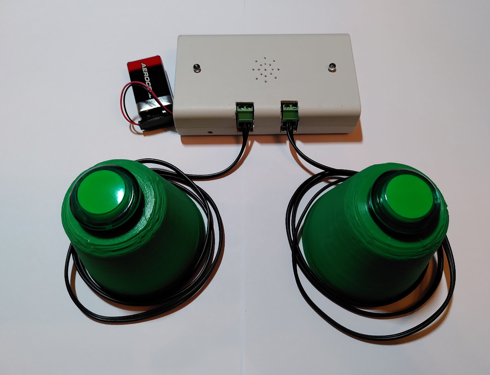
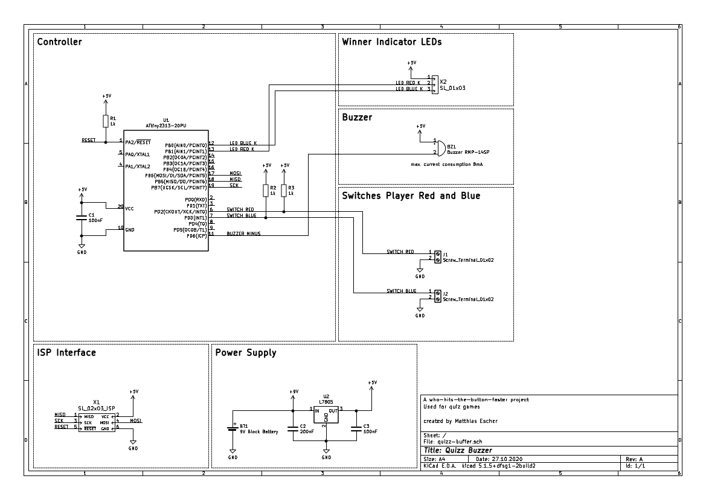

# Quizz Buzzer
A two player buzzer game which detects which of the players hits his button
first. This is typically used for quiz games. 

When the players hit their button, a beep sound is played, the button inputs are
locked and the indicator leds
start flickering (~1 second). After that, the led of the player which
hits his button faster is on, the led of the slower one is off. The winner led
is shown for about 1.5 seconds and during this time two short beep pulses and
one longer is played. The leds turn off and the button inputs are unlocked
again, ready for a new round. 

## Motivation
This project was a last minute build for game night I had planned for my friends
on Halloween. The plan was, that the group is split into two teams which then
fight against in mini games. For each game, the teams have to choose a player of
their own which compete against the other one. The team and the player who loses
the game, has to drink a shot of booze. The pool of games was a mix of physical
games where the teams have to proof their dexterity/agility but also some quiz games
where the player which answers faster (and of course right) wins. 

So the whole reason why I created this project was just because I needed
anything to detect for the quiz games which player was faster and which one must
be punished with a booze shot :)

# Schematic

There is also a PDF version of the schematic located under
`files/schematic-quizz-buzzer.pdf`

